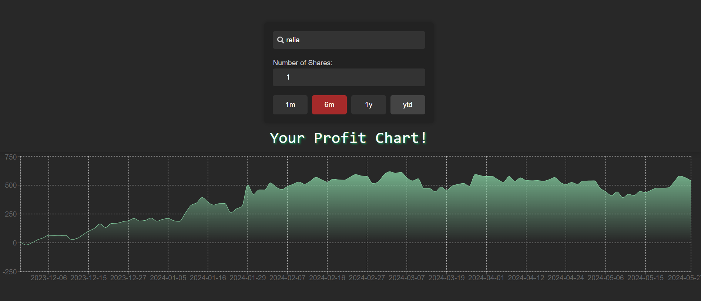
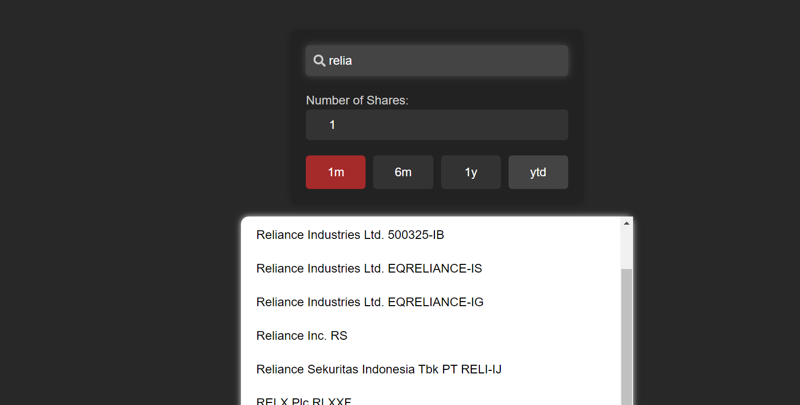

# 📈 StockProfitCalc

Welcome to **StockProfitCalc**! This tool is designed to help you visualize the potential profits of various stocks over different time periods. Whether you're an investor keeping track of your portfolio or a trader looking for the next big move, StockProfitCalc has you covered.

## 🚀 Features
  ### Profit Chart Visualization: Get a clear picture of your stock's performance over multiple time frames:
  - **1 Month**
  - **6 Months**
  - **1 Year**
  - **Year-to-Date (YTD)**
  
  <br/>
  
  ### Multi-Stock Search: Search multiple stocks across international exchanges.
  <br/>
  
  <br/>
  
  ### User-Friendly Interface: Simple and intuitive design to ensure ease of use.
  <br/>
  
  ### Real-Time Data: Updated with the latest market information to provide accurate profit calculations.

## 🛠️ Installation

   ```bash
   git clone https://github.com/devams23/stockprofitcalc.git
   cd stockprofitcalc
   npm install
  ```
## 📝 Example
Let's say you're interested in analyzing the stock performance of Apple (AAPL) and Microsoft (MSFT). Simply enter their ticker symbols in the search bar, and StockProfitCalc will generate profit charts showing how much you would have gained or lost if you had invested in these stocks 1 month, 6 months, 1 year ago, or from the start of the year to date.

## 🤝 Contributing
We welcome contributions from the community! Feel free to open issues or submit pull requests.

## 📞 Contact
For any questions or suggestions, please reach out to me at rckscience@gmail.com

